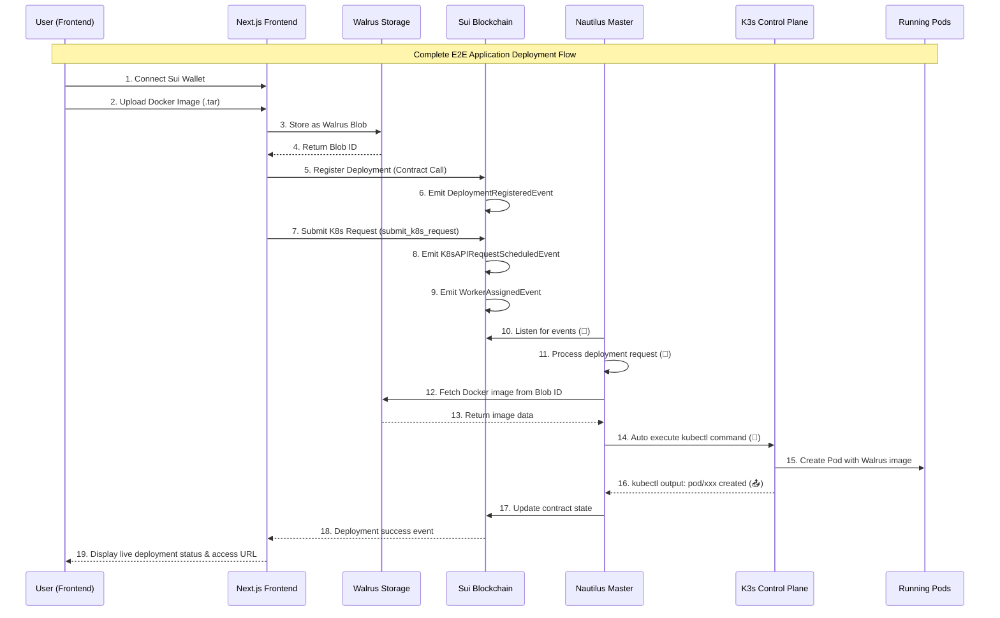
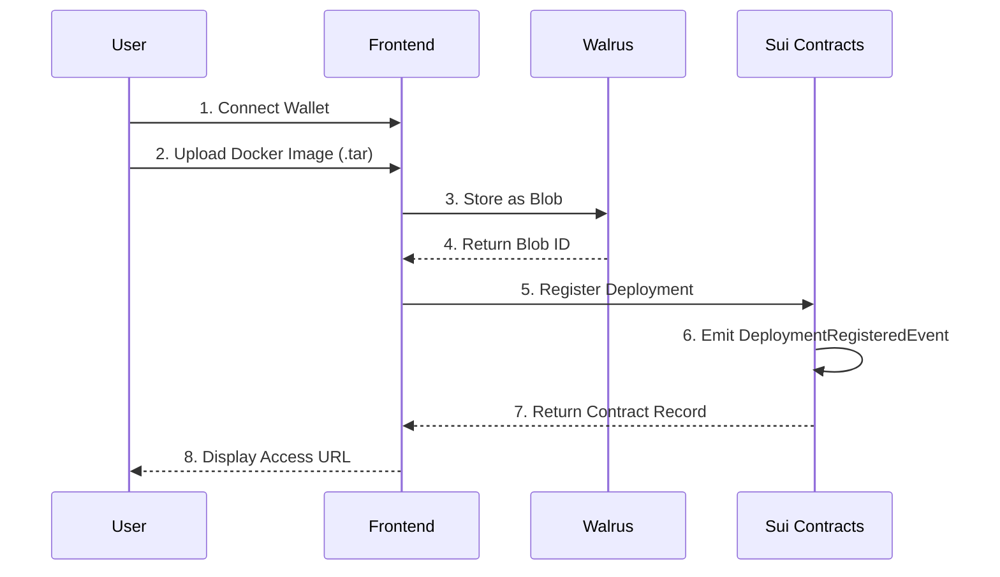
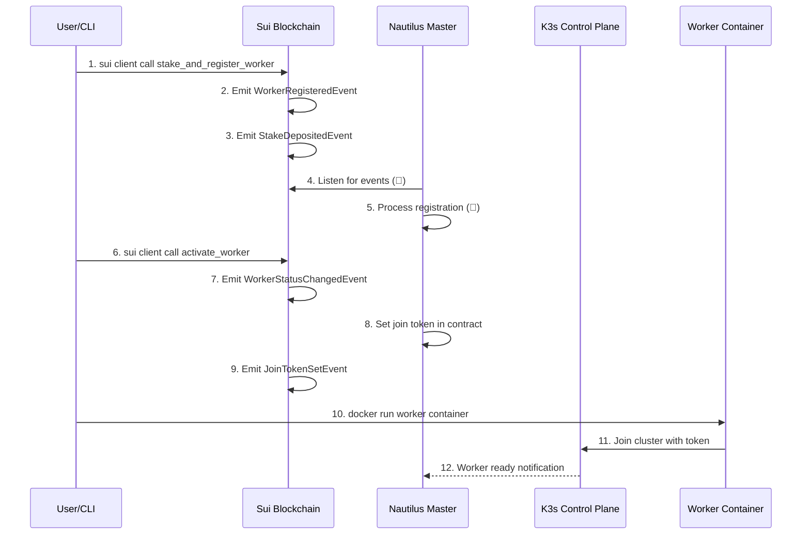
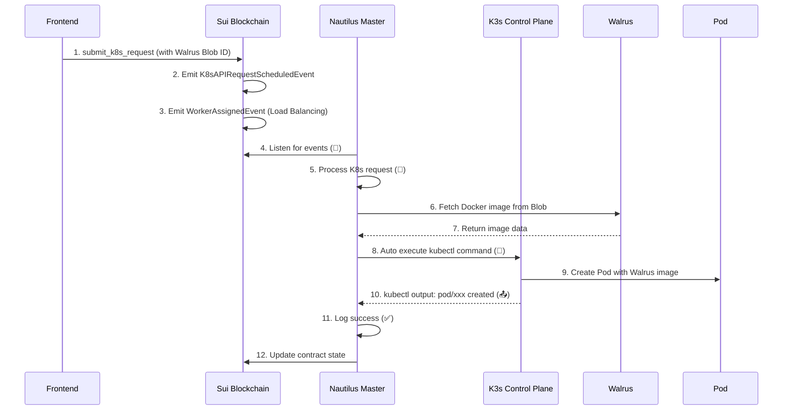

# DAAS-Vader: Sui's Decentralized Serverless Cloud Platform

Decentralized application deployment platform using Sui blockchain, Walrus distributed storage, and Kubernetes orchestration.

## Demo Video
[](https://youtu.be/-vzkZYCYSrM)
*Click the image above to watch: Team DAAS-Vader – Demo Video | Sui Hackathon Suimming*

## Project Overview

DaasVader is an **decentralized Kubernetes service integrated with Sui blockchain**, an innovative project that replaces traditional centralized authentication systems with **blockchain-based staking mechanisms**. 

Users are consumers of Sui's Vercel serverless platform, and compute providers (stakers) are shared Kubernetes administrators. Using Sui Nautilus for master node and control plane operations with Move contracts, and utilizing Nautilus for secure communications and verification processes (master node      verification). The goal is to become Sui's Vercel.

### Vision: Sui's Vercel
- **Users**: Deploy applications seamlessly through blockchain contracts (serverless experience)
- **Stakers**: Provide compute resources and earn rewards as shared Kubernetes cluster administrators
- **Walrus Storage**: Replace OCI/DockerHub with Sui-native container registry
- **Move Contracts**: Handle all authentication, authorization, and resource allocation
- **Goal**: Create a fully decentralized, trustless alternative to traditional cloud platforms

### Core Innovation Points
- **Sui blockchain + K8s native integration**
- **Sui Native architecture** (Replace OCI/DockerHub with Walrus as Sui-native Container Registry)
- **Real-time event processing** (Sui events → masternode execution)
- **Economic security model** (staking-based permission management)
- **Event-driven automation** (blockchain events trigger K8s operations)

## Complete E2E Architecture



## Component Detailed Analysis

### 1. Frontend (Next.js Web Application)
**Path**: `/frontend`
**Technology**: Next.js 14, TypeScript, Tailwind CSS

#### Core Functions
- **Wallet Integration**: Connect Sui wallets (Suiet, Slush Wallet)
- **File Upload Interface**: Browser-based upload of Docker images and project folders
- **Deployment Management**: Track and manage deployed applications
- **Real-time Monitoring**: Display deployment status and logs

#### Features
- **Project Folders**: Select and upload entire project directories
- **Docker Images**: Upload .tar files created with `docker save`
- **Individual Files**: Support for single file uploads
- **Deployment Dashboard**: View active deployments and access URLs

#### UI Demo Sections (Reserved for GIFs/Screenshots)


### 2. Walrus Storage Layer
**Integration**: Distributed storage for Docker images and application data

#### Core Functions
- **Blob Storage**: Store files as immutable blob objects in Walrus network
- **Content Addressing**: Assign unique IDs to each blob for permanent reference
- **Gateway Access**: Direct access support through Walrus gateway endpoints

### 3. Worker-Release (Computing Power Providers)
**Path**: `/worker-release`
**File count**: 127 Go files

#### Core Functions
- **K3s Agent execution**: Integrates standard K3s agent with Stake token authentication
- **Staking management**: Manages staking status by communicating with Sui blockchain
- **Metrics collection**: Monitors node performance and status
- **Auto registration**: Automatic cluster join using Stake tokens

#### Main File Structure
```
worker-release/
├── main.go                     # Entry point - worker node initialization
├── k3s_agent_integration.go    # K3s agent integration logic
├── pkg-reference/              # Modified k3s fork code (worker node)
│   ├── security/
│   │   ├── seal_auth.go       # Seal token authentication implementation
│   │   ├── sui_client.go      # Sui RPC client
│   │   └── kubectl_auth.go    # kubectl request authentication
│   ├── agent/
│   │   ├── run.go             # Agent execution logic
│   │   ├── config/            # Agent configuration
│   │   └── tunnel/            # Master connection tunnel
│   └── containerd/            # Container runtime integration
```

### 4. Nautilus-Release (Event-Driven Master Node)
**Path**: `/nautilus-release`
**File count**: 4 core Go files

#### Core Functions
- **K3s control plane**: Execute K3s master node in Docker container
- **Real-time blockchain event processing**: Listen and process Sui contract events
- **Auto kubectl execution**: Convert contract events to kubectl commands automatically
- **Enhanced monitoring**: Provide real-time logging with emoji indicators (📡🎉🚀🎯)

#### Main Implementation
```go
// Sui event processing structure
type SuiEventProcessor struct {
    logger      *logrus.Logger
    rpcClient   *sui.Client
    k3sManager  *K3sManager
    eventStream chan *SuiEvent
}

// K3s automation engine
type K3sManager struct {
    logger       *logrus.Logger
    kubectlPath  string
    configPath   string
    isRunning    bool
}
```

#### API Endpoints (Monitoring Only)
- `GET /healthz` - Health check endpoint
- `GET /readyz` - Ready status check
- `GET /api/nodes` - Query registered nodes status
- `GET /api/transactions/history` - Transaction history
- `POST /api/contract/call` - Contract state queries
- `ANY /api/*`, `/apis/*` - Kubernetes API proxy (port 6443)

### 5. Contracts-Release (Sui Smart Contracts)
**Path**: `/contracts-release`
**Deployed on**: Sui Testnet (Verified & Production Ready)

#### 📋 Contract Overview
| Contract | Address | Function | Status |
|----------|---------|----------|--------|
| **Package** | `0x029f3e4a78286e7534e2958c84c795cee3677c27f89dee56a29501b858e8892c` | Main package | ✅ Deployed |
| **Worker Registry** | `0x733fe1e93455271672bdccec650f466c835edcf77e7c1ab7ee37ec70666cdc24` | Worker management | ✅ Active |
| **K8s Scheduler** | `0x1e3251aac591d8390e85ccd4abf5bb3326af74396d0221f5eb2d40ea42d17c24` | Pod scheduling | ✅ Active |
| **Deployment Registry** | (To be deployed) | App deployment tracking | 🚧 In Progress |

#### Core Functions

| Function | Purpose | Events Emitted | Status |
|----------|---------|----------------|--------|
| `stake_and_register_worker` | Stake SUI & register worker | `WorkerRegisteredEvent`, `StakeDepositedEvent` | ✅ Tested |
| `activate_worker` | Activate staked worker | `WorkerStatusChangedEvent`, `JoinTokenSetEvent` | ✅ Tested |
| `submit_k8s_request` | Deploy Pods via contract | `K8sAPIRequestScheduledEvent`, `WorkerAssignedEvent` | ✅ Tested |
| `register_deployment` | Register app deployment | `DeploymentRegisteredEvent` | 🚧 Planned |

## Complete E2E Deployment Flow

### 1. Frontend to Walrus Upload Flow


### 2. Contract-Based Worker Registration Flow


### 3. Contract-Based K8s Deployment Flow

## Usage Guide

### 1. Connect Wallet

Connect your Sui wallet to get started. Make sure you have testnet SUI tokens for gas fees.

```
[WALLET CONNECTION STEP-BY-STEP GIF PLACEHOLDER]
```

### 2. Upload Options

- **Project Folders**: Select and upload entire project directories
- **Docker Images**: Upload .tar files created with `docker save`
- **Individual Files**: Support for single file uploads

```
[FILE UPLOAD OPTIONS DEMO GIF PLACEHOLDER]
```

### 3. Docker Deployment

```bash
# Build Docker image
docker build -t myapp .

# Save as tar archive
docker save myapp > myapp.tar

# Upload the tar file through the platform
```

```
[DOCKER DEPLOYMENT PROCESS GIF PLACEHOLDER]
```

### 4. Access Deployed Applications

After upload completion, you'll receive:

- Blob ID for permanent reference
- Direct access URL through Walrus gateways
- On-chain deployment record
- Real-time deployment status

```
[DEPLOYMENT DASHBOARD WITH LIVE STATUS GIF PLACEHOLDER]
```
## Project Structure

```
project-root/
├── frontend/             # Next.js web application
│   ├── components/       # React components
│   ├── pages/           # Next.js pages
│   ├── styles/          # Tailwind CSS styles
│   └── utils/           # Utility functions
├── worker-release/       # K3s worker node implementation
├── nautilus-release/     # K3s master node implementation
├── contracts-releases/   # Sui smart contracts
├── docs/                # Project documentation
├── walrus/              # Walrus storage configuration
└── seal/                # Encryption module
```
