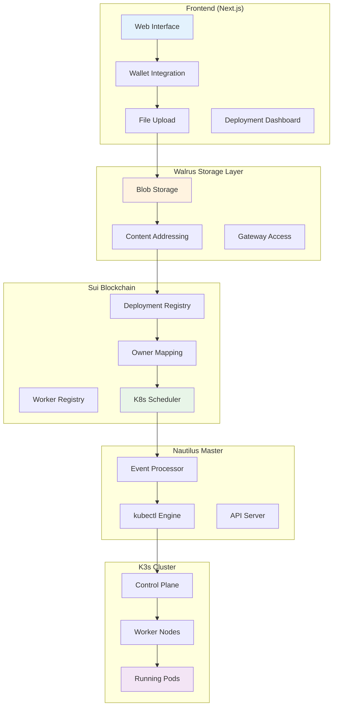

# DAAS-Vader: Sui's Decentralized Serverless Cloud Platform


Decentralized application deployment platform using Sui blockchain, Walrus distributed storage, and Kubernetes orchestration.

## Project Overview

DaasVader is an **decentralized Kubernetes service integrated with Sui blockchain**, an innovative project that replaces traditional centralized authentication systems with **blockchain-based staking mechanisms**. 

Users are consumers of Sui's Vercel serverless platform, and compute providers (stakers) are shared Kubernetes administrators. Using Sui Nautilus for master node and control plane operations with Move contracts, and utilizing Nautilus for secure communications and verification processes (master node      verification). The goal is to become Sui's Vercel.

### Vision: Sui's Vercel
- **Users**: Deploy applications seamlessly through blockchain contracts (serverless experience)
- **Stakers**: Provide compute resources and earn rewards as shared Kubernetes cluster administrators
- **Walrus Storage**: Replace OCI/DockerHub with Sui-native container registry
- **Move Contracts**: Handle all authentication, authorization, and resource allocation
- **Goal**: Create a fully decentralized, trustless alternative to traditional cloud platforms

### Core Innovation Points
- **Sui blockchain + K8s native integration**
- **Sui Native architecture** (Replace OCI/DockerHub with Walrus as Sui-native Container Registry)
- **Real-time event processing** (Sui events → masternode execution)
- **Economic security model** (staking-based permission management)
- **Event-driven automation** (blockchain events trigger K8s operations)

## Complete E2E Architecture

### Frontend Layer (User Interface)



## Component Detailed Analysis

### 1. Frontend (Next.js Web Application)
**Path**: `/frontend`
**Technology**: Next.js 14, TypeScript, Tailwind CSS

#### Core Functions
- **Wallet Integration**: Connect Sui wallets (Suiet, Slush Wallet)
- **File Upload Interface**: Browser-based upload of Docker images and project folders
- **Deployment Management**: Track and manage deployed applications
- **Real-time Monitoring**: Display deployment status and logs

#### Features
- **Project Folders**: Select and upload entire project directories
- **Docker Images**: Upload .tar files created with `docker save`
- **Individual Files**: Support for single file uploads
- **Deployment Dashboard**: View active deployments and access URLs

#### UI Demo Sections (Reserved for GIFs/Screenshots)
```
[WALLET CONNECTION DEMO GIF PLACEHOLDER]
[FILE UPLOAD INTERFACE DEMO GIF PLACEHOLDER]
[DEPLOYMENT DASHBOARD DEMO GIF PLACEHOLDER]
[REAL-TIME MONITORING DEMO GIF PLACEHOLDER]
```

### 2. Walrus Storage Layer
**Integration**: Distributed storage for Docker images and application data

#### Core Functions
- **Blob Storage**: Store files as immutable blob objects in Walrus network
- **Content Addressing**: Assign unique IDs to each blob for permanent reference
- **Gateway Access**: Direct access support through Walrus gateway endpoints

### 3. Worker-Release (Computing Power Providers)
**Path**: `/worker-release`
**File count**: 127 Go files

#### Core Functions
- **K3s Agent execution**: Integrates standard K3s agent with Stake token authentication
- **Staking management**: Manages staking status by communicating with Sui blockchain
- **Metrics collection**: Monitors node performance and status
- **Auto registration**: Automatic cluster join using Stake tokens

#### Main File Structure
```
worker-release/
├── main.go                     # Entry point - worker node initialization
├── k3s_agent_integration.go    # K3s agent integration logic
├── pkg-reference/              # Modified k3s fork code (worker node)
│   ├── security/
│   │   ├── seal_auth.go       # Seal token authentication implementation
│   │   ├── sui_client.go      # Sui RPC client
│   │   └── kubectl_auth.go    # kubectl request authentication
│   ├── agent/
│   │   ├── run.go             # Agent execution logic
│   │   ├── config/            # Agent configuration
│   │   └── tunnel/            # Master connection tunnel
│   └── containerd/            # Container runtime integration
```

### 4. Nautilus-Release (Event-Driven Master Node)
**Path**: `/nautilus-release`
**File count**: 4 core Go files

#### Core Functions
- **K3s control plane**: Execute K3s master node in Docker container
- **Real-time blockchain event processing**: Listen and process Sui contract events
- **Auto kubectl execution**: Convert contract events to kubectl commands automatically
- **Enhanced monitoring**: Provide real-time logging with emoji indicators (📡🎉🚀🎯)

#### Main Implementation
```go
// Sui event processing structure
type SuiEventProcessor struct {
    logger      *logrus.Logger
    rpcClient   *sui.Client
    k3sManager  *K3sManager
    eventStream chan *SuiEvent
}

// K3s automation engine
type K3sManager struct {
    logger       *logrus.Logger
    kubectlPath  string
    configPath   string
    isRunning    bool
}
```

#### API Endpoints (Monitoring Only)
- `GET /healthz` - Health check endpoint
- `GET /readyz` - Ready status check
- `GET /api/nodes` - Query registered nodes status
- `GET /api/transactions/history` - Transaction history
- `POST /api/contract/call` - Contract state queries
- `ANY /api/*`, `/apis/*` - Kubernetes API proxy (port 6443)

### 5. Contracts-Release (Sui Smart Contracts)
**Path**: `/contracts-release`
**Deployed on**: Sui Testnet (Verified & Production Ready)

#### 📋 Contract Overview
| Contract | Address | Function | Status |
|----------|---------|----------|--------|
| **Package** | `0x029f3e4a78286e7534e2958c84c795cee3677c27f89dee56a29501b858e8892c` | Main package | ✅ Deployed |
| **Worker Registry** | `0x733fe1e93455271672bdccec650f466c835edcf77e7c1ab7ee37ec70666cdc24` | Worker management | ✅ Active |
| **K8s Scheduler** | `0x1e3251aac591d8390e85ccd4abf5bb3326af74396d0221f5eb2d40ea42d17c24` | Pod scheduling | ✅ Active |
| **Deployment Registry** | (To be deployed) | App deployment tracking | 🚧 In Progress |

#### 🔥 Core Functions

| Function | Purpose | Events Emitted | Status |
|----------|---------|----------------|--------|
| `stake_and_register_worker` | Stake SUI & register worker | `WorkerRegisteredEvent`, `StakeDepositedEvent` | ✅ Tested |
| `activate_worker` | Activate staked worker | `WorkerStatusChangedEvent`, `JoinTokenSetEvent` | ✅ Tested |
| `submit_k8s_request` | Deploy Pods via contract | `K8sAPIRequestScheduledEvent`, `WorkerAssignedEvent` | ✅ Tested |
| `register_deployment` | Register app deployment | `DeploymentRegisteredEvent` | 🚧 Planned |

## Complete E2E Deployment Flow

### 1. Frontend to Walrus Upload Flow


### 2. Contract-Based Worker Registration Flow

```mermaid
sequenceDiagram
    participant U as User/CLI
    participant B as Sui Blockchain
    participant N as Nautilus Master
    participant K as K3s Control Plane
    participant W as Worker Container

    U->>B: 1. sui client call stake_and_register_worker
    B->>B: 2. Emit WorkerRegisteredEvent
    B->>B: 3. Emit StakeDepositedEvent
    N->>B: 4. Listen for events (📡)
    N->>N: 5. Process registration (🎉)
    U->>B: 6. sui client call activate_worker
    B->>B: 7. Emit WorkerStatusChangedEvent
    N->>N: 8. Set join token in contract
    B->>B: 9. Emit JoinTokenSetEvent
    U->>W: 10. docker run worker container
    W->>K: 11. Join cluster with token
    K-->>N: 12. Worker ready notification
```


### 3. Contract-Based K8s Deployment Flow

```mermaid
sequenceDiagram
    participant F as Frontend
    participant B as Sui Blockchain
    participant N as Nautilus Master
    participant K as K3s Control Plane
    participant W as Walrus
    participant P as Pod

    F->>B: 1. submit_k8s_request (with Walrus Blob ID)
    B->>B: 2. Emit K8sAPIRequestScheduledEvent
    B->>B: 3. Emit WorkerAssignedEvent (Load Balancing)
    N->>B: 4. Listen for events (📡)
    N->>N: 5. Process K8s request (🚀)
    N->>W: 6. Fetch Docker image from Blob
    W-->>N: 7. Return image data
    N->>K: 8. Auto execute kubectl command (🎯)
    K->>P: 9. Create Pod with Walrus image
    K-->>N: 10. kubectl output: pod/xxx created (📤)
    N->>N: 11. Log success (✅)
    N->>B: 12. Update contract state
```


## Technology Stack

### Frontend
- **Framework**: Next.js 14
- **Language**: TypeScript
- **Styling**: Tailwind CSS
- **Wallet Integration**: Sui TypeScript SDK

### Backend Infrastructure
- **Blockchain**: Sui Network
- **Storage**: Walrus Decentralized Storage
- **Orchestration**: K3s (Lightweight Kubernetes)
- **Language**: Go (Backend services)
- **Smart Contracts**: Move

### Development Tools
- **Package Manager**: npm/yarn
- **Build Tool**: Docker
- **Testing**: Sui CLI, kubectl

## Getting Started

### Requirements

- Node.js 18+
- npm or yarn
- Sui wallet (Suiet or Slush Wallet)
- Testnet SUI tokens
- Docker (for image building)

### Installation

```bash
# Navigate to frontend directory
cd frontend

# Install dependencies
npm install

# Start development server
npm run dev
```

Access the application at http://localhost:3000

## Usage Guide

### 1. Connect Wallet

Connect your Sui wallet to get started. Make sure you have testnet SUI tokens for gas fees.

```
[WALLET CONNECTION STEP-BY-STEP GIF PLACEHOLDER]
```

### 2. Upload Options

- **Project Folders**: Select and upload entire project directories
- **Docker Images**: Upload .tar files created with `docker save`
- **Individual Files**: Support for single file uploads

```
[FILE UPLOAD OPTIONS DEMO GIF PLACEHOLDER]
```

### 3. Docker Deployment

```bash
# Build Docker image
docker build -t myapp .

# Save as tar archive
docker save myapp > myapp.tar

# Upload the tar file through the platform
```

```
[DOCKER DEPLOYMENT PROCESS GIF PLACEHOLDER]
```

### 4. Access Deployed Applications

After upload completion, you'll receive:

- Blob ID for permanent reference
- Direct access URL through Walrus gateways
- On-chain deployment record
- Real-time deployment status

```
[DEPLOYMENT DASHBOARD WITH LIVE STATUS GIF PLACEHOLDER]
```

## Quick Usage Examples

### Stake Worker (1 SUI)
```bash
sui client call --package 0x029f3e... --module worker_registry \
  --function stake_and_register_worker \
  --args [REGISTRY] [COIN_1_SUI] "worker-001" "seal_token"
```

### Deploy Application via Frontend
1. Connect Sui wallet
2. Upload Docker tar file
3. Confirm blockchain transaction
4. Wait for deployment completion
5. Access via provided URL

### Monitor Deployment Status
```bash
sui client call --package 0x029f3e... --module k8s_scheduler \
  --function get_active_request_count --args [SCHEDULER]
```

## Project Structure

```
project-root/
├── frontend/             # Next.js web application
│   ├── components/       # React components
│   ├── pages/           # Next.js pages
│   ├── styles/          # Tailwind CSS styles
│   └── utils/           # Utility functions
├── worker-release/       # K3s worker node implementation
├── nautilus-release/     # K3s master node implementation
├── contracts-releases/   # Sui smart contracts
├── docs/                # Project documentation
├── walrus/              # Walrus storage configuration
└── seal/                # Encryption module
```

## Security Layers
1. **Blockchain-based trust**: All operations recorded on Sui
2. **Economic security**: Staking slashing for malicious behavior
3. **Encryption**: All communication TLS 1.3
4. **Access control**: Staking amount-based RBAC
5. **Audit**: All API calls recorded on blockchain
6. **Immutable storage**: Walrus ensures data permanence

## Future Roadmap

### Phase 1 (Completed) ✅
- K3s + Sui blockchain integration
- Contract-first architecture implementation
- Real-time event processing with enhanced logging
- Worker registry and K8s scheduler contracts
- Event-driven kubectl automation
- Docker containerization and deployment
- Verified E2E workflow (staking → activation → pod deployment)

### Phase 2 (In Progress) 🚧
- Frontend web application with wallet integration
- Walrus storage integration for container images
- Deployment registry smart contracts
- Enhanced monitoring dashboard with real-time metrics
- Auto-scaling based on contract workload data

### Phase 3 (Planned) 📋
- Multi-cloud worker node support
- Advanced deployment strategies (blue-green, canary)
- Integrated CI/CD pipelines
- Enterprise features and SLA guarantees
- Cross-chain bridge integrations

---

**Status**: 🟢 **Production Ready Backend** | 🚧 **Frontend Integration in Progress**
**Verification**: 🔥 **Live Testnet Validated**
**Architecture**: 💯 **Truly Decentralized Sui's Vercel**
